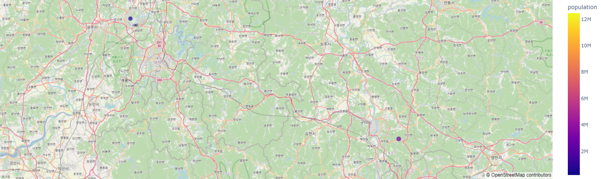
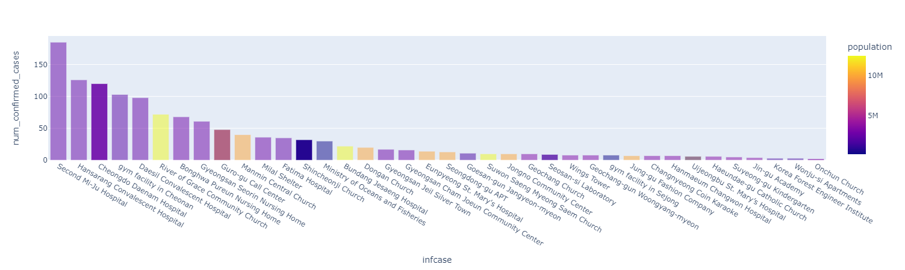

# cc-visuals-tigergraph
Goal: To Create Interactive Maps to Visualise South Korean COVID-19 Cases using Plotly Express, Plotly Dash, and TigerGraph using Covid-19 Analysis Kit with 33,000 vertices and 49,000 edges of COVID-19 data.

[Video Link](https://drive.google.com/file/d/17nGJzboZvM1RYZXTcdo3A-nLgTfmZBLo/view?usp=sharing)
